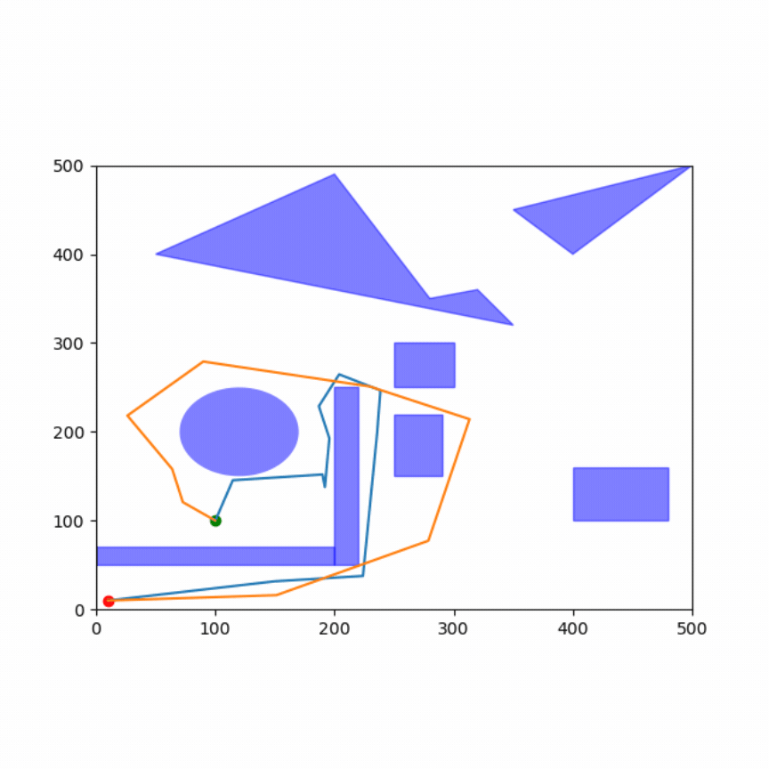
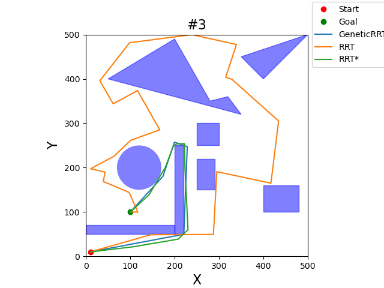
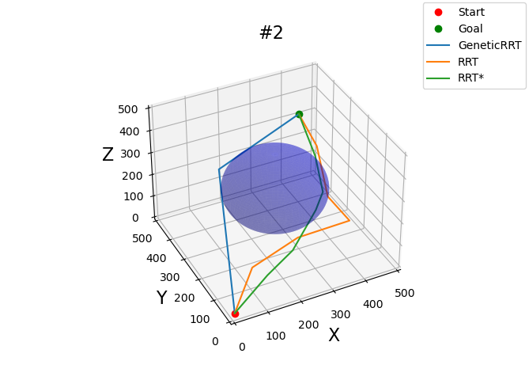
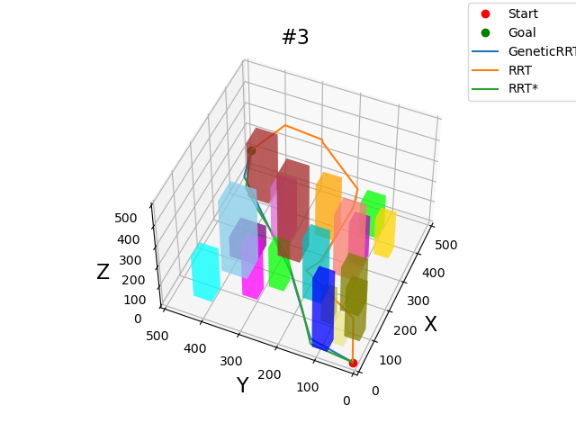
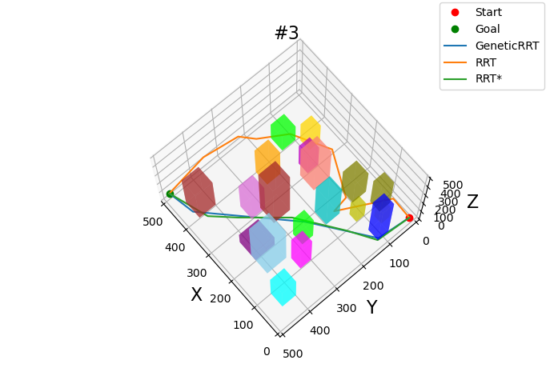

# GeneticRRT

## Table of Contents
- [About](#about)
- [Installation](#installation)
- [Usage](#usage)
- [Examples](#examples)

## About
GeneticRRT is a c++ implementaion of a path planning algorithm that combines Rapidly-exploring Random Tree (RRT) with Genetic Algorithms (GA). The algorithm is designed to finding best path in complex and variety of spaces. Idea is based on [article](https://www.researchgate.net/publication/370216685_Genetic_RRT_Asymptotically_Optimal_Sampling-based_Path_Planning_via_Optimization_of_Genetic_Algorithm).

### Key Concepts:
- **Sampling-Based Motion Planning**: A planning approach that randomly sample configrations in free space, trying to find path between two states.
- **RRT**: A randomized algorithm used to efficiently explore large spaces, commonly applied in robotics and sampling-based path planning.
- **Genetic Algorithm**: An optimization technique based on the process of natural selection, used to find approximate solutions to complex optimization problems.

By combining these two methods, GeneticRRT enhances the path search process by focusing on optimizing the solution with evolutionary techniques

## Installation
To use GeneticRRT, you'll need:
- **g++/clang++**: The project requires **C++17** or newer. Make sure your compiler supports this version.
- **CMake**: Minimum required version is 3.10.
- **OMPL**: Minimum required version is ompl-1.6.

```bash
git clone https://github.com/Spror/GeneticRRT.git
```
```bash
cd GeneticRRT
mkdir build && cd build
cmake ..
make
```
## Usage
Once the project is set up, you can use the GeneticRRT module to generate paths for different environments.

```c++
#include <ompl/base/SpaceInformation.h>
#include <ompl/base/spaces/SE3StateSpace.h>
#include <ompl/geometric/planners/rrt/RRTConnect.h>
#include <ompl/geometric/SimpleSetup.h>

#include <ompl/config.h>
#include <iostream>
  
#include <GeneticRRT.hpp>

namespace ob = ompl::base;
namespace og = ompl::geometric;

bool isStateValid(const ob::State *state)
{
    // code here
}

int main(){

    // construct the state space we are planning in
    auto space(std::make_shared<ob::SE2StateSpace>());

    // set the bounds for the R^3 part of SE(3)
    ob::RealVectorBounds bounds(2);
    bounds.setLow(0);
    bounds.setHigh(500);

    space->setBounds(bounds);
    / construct an instance of  space information from this state space
    auto si(std::make_shared<ob::SpaceInformation>(space));

    // set state validity checking for this space
    si->setStateValidityChecker(isStateValidSE2_1);
    si->setStateValidityCheckingResolution(0.01); 
    si->setup();

    // create a random start state
    ob::ScopedState<> start(space);
    start->as<ob::SE2StateSpace::StateType>()->setX(10);
    start->as<ob::SE2StateSpace::StateType>()->setY(10);
    start->as<ob::SE2StateSpace::StateType>()->setYaw(0);

    // create a random goal state
    ob::ScopedState<> goal(space);
    goal->as<ob::SE2StateSpace::StateType>()->setX(450);
    goal->as<ob::SE2StateSpace::StateType>()->setY(440);
    goal->as<ob::SE2StateSpace::StateType>()->setYaw(0);

    // create a problem instance
    auto pdef(std::make_shared<ob::ProblemDefinition>(si));

    // set the start and goal states
    pdef->setStartAndGoalStates(start, goal);

    // create a planner for the defined space
    auto planner(std::make_shared<ompl::GeneticRRT>(si));

    planner->setPopulation(population);
    planner->setGeneration(generations);
    planner->setProbability(probabilty);

    // set the problem we are trying to solve for the planner
    planner->setProblemDefinition(pdef);

    // perform setup steps for the planner
    planner->setup();

    // attempt to solve the problem 
    ob::PlannerStatus solved = planner->ob::Planner::solve(10.0);

    if (solved)
    {
        // code here
    }
    else
        std::cout << "No solution found" << std::endl;

}
```
### Examples








